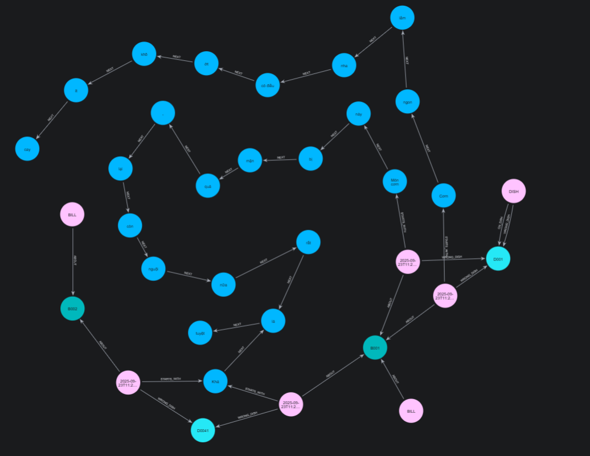

# ✨ "Schema definition and data ingestion pipeline in Neo4j"


## 0. Add a requirement:

```pip
pip install underthesea
```

## 1. Add File to neo4j/plugins

* If you prefer manual: visit https://github.com/neo4j/apoc/releases

or

```bash
# inside the container (or download manually)
wget https://github.com/neo4j/apoc/releases/download/5.26.8/apoc-5.26.8-extended.jar \
     -O /plugins/apoc-5.26.8-extended.jar
```

* check version

```cypher
RETURN apoc.version();
```

## 2. Setup Docker

```yaml
neo4j:
    ...
    volumes:
        - ./neo4j/logs:/logs
        # - ./neo4j/config:/config
        - ./neo4j/data:/data
        - ./neo4j/plugins:/plugins
        - ./src/data/csv:/var/lib/neo4j/import # <-- new
    ...
    environment:
        - NEO4J_AUTH=neo4j/12345678 # user/password
        - NEO4J_PLUGINS=["graph-data-science"]
        - NEO4J_dbms_security_procedures_allowlist=gds.*,apoc.* # <-- new
        - NEO4J_apoc_import_file_enabled=true # <-- new
```

## 3. Create csv File

* customers.csv

```csv
customer_id,full_name,phone,email,dob,gender,notes
C001,Nguyễn Văn A,0901111222,a@mail.com,1990-05-10,male,
C002,Trần Thị B,0903334444,b@mail.com,1985-11-20,female,
```

* dishes.csv

```csv
dish_id,type_of_food,name_of_food,how_to_prepare,main_ingredients,taste,outstanding_fragrance,current_price,number_of_people_eating
D001,MÓN KHAI VỊ,Bánh xèo,"Đổ bột gạo pha nước cốt dừa, chiên vàng giòn cùng topping","Bột gạo, tôm, thịt ba chỉ, giá đỗ,...",Đồ béo,"Thơm và béo của nước cốt dừa hoà quyện cùng topping (tôm, thịt,..)","145,000",2-3
D002,MÓN KHAI VỊ,Bánh khọt nước dừa,"Đổ bột gạo pha nước cốt dừa vào khuôn nhỏ, chiên giòn cùng topping","Bột  gạo, nước cốt dừa, tôm",Đồ béo,"Thơm và béo của nước cốt dừa hoà quyện cùng topping (tôm, thịt,..)","145,000",2-3
D003,MÓN KHAI VỊ,Hến xúc bánh đa,"Hến xào hành, rau răm, ăn kèm bánh đa","Hến, rau răm, bánh đa","Đồ mặn, cay","Vị ngọt béo tự nhiên của hến, cay nhẹ của ớt và rau răm, tiêu","155,000",1-2
D004,MÓN KHAI VỊ,Mực chiên giòn,"Mực tẩm bột chiên xù, chiên vàng","Mực, bột chiên",Đồ béo,"Mực tươi, béo của bột chiên giòn","175,000",2-3
```

* ingredients.csv

```csv
name
Bột gạo
Nước cốt dừa
Tôm
Thịt ba chỉ
Giá đỗ
Gà
```

* dish_ingredient.csv

```csv
dish_id,ingredient_name
D001,Bột gạo
D001,Nước cốt dừa
D001,Tôm
D001,Thịt ba chỉ
D001,Giá đỗ
D002,Gà
```

* tags.csv

```csv
tag
Đồ béo
Món khô
Nhạt
Món nước
```

* dish_tag.csv

```csv
dish_id,tag
D001,Đồ béo
D001,Món khô
D002,Nhạt
```

* bills.csv

```csv
bill_id,customer_id,create_date,total_amount,people_count,payment_method,status
B001,C001,2025-09-21,145000,2,cash,completed
B002,C002,2025-09-21,85000,1,card,completed
```

* bill_items.csv

```csv
bill_id,dish_id,quantity,unit_price
B001,D001,1,145000
B002,D002,1,85000
```

* feedbacks.csv

```csv
feedback_id,customer_id,target_type,target_id,rating,comment,tasted_good,would_reorder,created_at
FB001,C001,DISH,D001,5,"Giòn, thơm, chất lượng",true,true,2025-09-21T13:05:00
FB002,C002,BILL,B002,4,"Thanh toán nhanh, nhân viên tốt",,,2025-09-21T20:00:00
```

* surveys.csv

```csv
customer_id,type,value,weight
C001,tag,Đồ béo,5
C001,time_slot,18:00-20:30,4
C001,day_of_week,Mon,3
C002,tag,Nhạt,4
```

* promotions.csv

```csv
promo_id,desc,discount_pct,start_date,end_date
P001,Giảm 10% món khai vị,10,2025-09-01,2025-09-30
```

* customer_promo.csv

```csv
customer_id,promo_id,redeem_date
C001,P001,2025-09-21
```

* staff.csv

```csv
staff_id,name
S001,Lê Thị Tư vấn
```

* suggestions.csv

```csv
staff_id,customer_id,dish_id,reason,score
S001,C001,D002,"Khách thích món nhạt",0.9
```

* customer_questions.csv

```csv
question_id,customer_id,text,intent_name,channel_name,created_at
Q001,C001,"Món nào béo béo mà không cay?","fat_non_spicy","chat","2025-09-22T10:00:00"
Q002,C002,"Tôi ăn chay, có món gì?",          "vegan",       "email","2025-09-22T11:00:00"
```

## 4. Create Constraint and Index

```cypher
// Xóa sạch (test only)
// MATCH (n) DETACH DELETE n;

// Constraints
CREATE CONSTRAINT cust_id   IF NOT EXISTS FOR (c:Customer)  REQUIRE c.customer_id IS UNIQUE;
CREATE CONSTRAINT dish_id   IF NOT EXISTS FOR (d:Dish)      REQUIRE d.dish_id IS UNIQUE;
CREATE CONSTRAINT ing_name  IF NOT EXISTS FOR (i:Ingredient) REQUIRE i.name IS UNIQUE;
CREATE CONSTRAINT tag_name  IF NOT EXISTS FOR (t:Tag)        REQUIRE t.tag IS UNIQUE;
CREATE CONSTRAINT bill_id   IF NOT EXISTS FOR (b:Bill)       REQUIRE b.bill_id IS UNIQUE;
CREATE CONSTRAINT fb_id     IF NOT EXISTS FOR (f:Feedback)   REQUIRE f.feedback_id IS UNIQUE;
CREATE CONSTRAINT promo_id  IF NOT EXISTS FOR (p:Promotion)  REQUIRE p.promo_id IS UNIQUE;
CREATE CONSTRAINT staff_id  IF NOT EXISTS FOR (s:Staff)      REQUIRE s.staff_id IS UNIQUE;

// Index
CREATE INDEX bill_cust IF NOT EXISTS FOR (b:Bill) ON (b.customer_id);
CREATE INDEX fb_target IF NOT EXISTS FOR (f:Feedback) ON (f.target_type, f.target_id);

// Index mới cho Dish
CREATE INDEX dish_name   IF NOT EXISTS FOR (d:Dish) ON (d.name_of_food);
CREATE INDEX dish_price  IF NOT EXISTS FOR (d:Dish) ON (d.current_price);
CREATE INDEX dish_type   IF NOT EXISTS FOR (d:Dish) ON (d.type_of_food);

// Index trên property của relationship type WRONG_DISH
CREATE INDEX wrong_dish_value IF NOT EXISTS
FOR ()-[r:WRONG_DISH]-() ON (r.value);

CREATE INDEX IF NOT EXISTS FOR (b:Bill) ON (b.bill_id);
CREATE INDEX IF NOT EXISTS FOR (f:Feedback) ON (f.feedback_id);

CREATE CONSTRAINT issue_name_unique IF NOT EXISTS
FOR (i:Issue) REQUIRE i.name IS UNIQUE;

CREATE INDEX issue_name_idx IF NOT EXISTS
FOR (i:Issue) ON (i.name);
```

* check file csv update from ./src/data/csv to import

```bash
MSYS_NO_PATHCONV=1 docker exec -it neo4j ls /var/lib/neo4j/import
```

result:

```text
bill_items.csv  customer_promo.csv  dish_ingredient.csv  dishes.csv     ingredients.csv  promotions.csv  suggestions.csv  tags.csv
bills.csv       customers.csv       dish_tag.csv         feedbacks.csv  orders.csv       staff.csv       surveys.csv      ...
```

## 5. Load data to Neo4j

### 5.1. Node thuần

```cypher
LOAD CSV WITH HEADERS FROM 'file:///customers.csv' AS r
CREATE (c:Customer) SET c = r, c.dob = date(r.dob);

LOAD CSV WITH HEADERS FROM 'file:///dishes.csv' AS r
CREATE (d:Dish)
SET d.dish_id              = r.dish_id,
    d.type_of_food         = r.type_of_food,
    d.name_of_food         = r.name_of_food,
    d.how_to_prepare       = r.how_to_prepare,
    d.main_ingredients     = r.main_ingredients,
    d.taste                = r.taste,
    d.outstanding_fragrance= r.outstanding_fragrance,
    d.current_price        = toInteger(REPLACE(r.current_price, ",","")),
    d.number_of_people_eating = r.number_of_people_eating;

LOAD CSV WITH HEADERS FROM 'file:///ingredients.csv' AS r
MERGE (i:Ingredient {name: r.name});

LOAD CSV WITH HEADERS FROM 'file:///tags.csv' AS r
MERGE (t:Tag {tag: r.tag});

LOAD CSV WITH HEADERS FROM 'file:///bills.csv' AS r
CREATE (b:Bill) SET b = r,
  b.create_date  = date(r.create_date),
  b.total_amount = toInteger(r.total_amount),
  b.people_count = toInteger(r.people_count);

LOAD CSV WITH HEADERS FROM 'file:///promotions.csv' AS r
CREATE (p:Promotion) SET p = r,
  p.discount_pct = toFloat(r.discount_pct),
  p.start_date   = date(r.start_date),
  p.end_date     = date(r.end_date);

LOAD CSV WITH HEADERS FROM 'file:///staff.csv' AS r
CREATE (s:Staff) SET s = r;

```

### 5.2. Relationship master-data

```cypher
LOAD CSV WITH HEADERS FROM 'file:///bill_items.csv' AS r
MATCH (b:Bill {bill_id: r.bill_id})
MATCH (d:Dish {dish_id: r.dish_id})
MERGE (b)-[:CONTAINS {quantity: toInteger(r.quantity), unit_price: toInteger(r.unit_price)}]->(d);

LOAD CSV WITH HEADERS FROM 'file:///bills.csv' AS r
MATCH (c:Customer {customer_id: r.customer_id})
MATCH (b:Bill     {bill_id: r.bill_id})
MERGE (c)-[:PLACED]->(b);
```

### 5.3. Bill ⇄ Dish

```cypher
LOAD CSV WITH HEADERS FROM 'file:///bill_items.csv' AS r
MATCH (b:Bill {bill_id: r.bill_id})
MATCH (d:Dish {dish_id: r.dish_id})
MERGE (b)-[:CONTAINS {quantity: toInteger(r.quantity), unit_price: toInteger(r.unit_price)}]->(d);
```

### 5.4. Customer ⇄ Bill

```cypher
LOAD CSV WITH HEADERS FROM 'file:///bills.csv' AS r
MATCH (c:Customer {customer_id: r.customer_id})
MATCH (b:Bill     {bill_id: r.bill_id})
MERGE (c)-[:PLACED]->(b);
```

### 5.5. Feedback (chung)

```cypher
LOAD CSV WITH HEADERS FROM 'file:///feedbacks.csv' AS r
CREATE (f:Feedback)
SET f.feedback_id   = r.feedback_id,
    f.target_type   = r.target_type,
    f.rating        = toInteger(r.rating),
    f.comment       = r.comment,
    f.tasted_good   = CASE r.tasted_good WHEN 'true' THEN true WHEN 'false' THEN false ELSE null END,
    f.would_reorder = CASE r.would_reorder WHEN 'true' THEN true WHEN 'false' THEN false ELSE null END,
    f.created_at    = datetime(r.created_at);


// Customer → Feedback
LOAD CSV WITH HEADERS FROM 'file:///feedbacks.csv' AS r
MATCH (c:Customer {customer_id: r.customer_id})
MATCH (f:Feedback {feedback_id: r.feedback_id})
MERGE (c)-[:WROTE]->(f);

// Feedback → Dish   (target_type = DISH)
LOAD CSV WITH HEADERS FROM 'file:///feedbacks.csv' AS r
WITH r WHERE r.target_type = 'DISH'
MATCH (f:Feedback {feedback_id: r.feedback_id})
MATCH (d:Dish     {dish_id: r.target_id})
MERGE (f)-[:ON_DISH]->(d);

// Feedback → Bill   (target_type = BILL)  -- chỉ 1 relationship
LOAD CSV WITH HEADERS FROM 'file:///feedbacks.csv' AS r
WITH r WHERE r.target_type = 'BILL'
MATCH (f:Feedback {feedback_id: r.feedback_id})
MATCH (b:Bill     {bill_id: r.target_id})
MERGE (f)-[:ABOUT]->(b);          // <-- dùng duy nhất ABOUT

// Customer → Bill  (FEEDBACK_BILL)
LOAD CSV WITH HEADERS FROM 'file:///customer_feedback_bill.csv' AS row
MATCH (c:Customer {customer_id: row.customer_id})
MATCH (b:Bill {bill_id: row.bill_id})
MERGE (c)-[:FEEDBACK_BILL]->(b);

// (Tuỳ chọn) Feedback → Dish  (WRONG_DISH)
LOAD CSV WITH HEADERS FROM 'file:///feedbacks.csv' AS row
WITH row WHERE row.feedback_id = 'FB001'   // demo
MATCH (f:Feedback {feedback_id: row.feedback_id})
MATCH (d:Dish {dish_id: 'D001'})
MERGE (f)-[:WRONG_DISH {value: 1}]->(d);
```

### 5.6. Survey (sở thích/thói quen)

```cypher
LOAD CSV WITH HEADERS FROM 'file:///surveys.csv' AS r
MATCH (c:Customer {customer_id: r.customer_id})
CALL apoc.do.case([
  r.type = 'tag', '
    MERGE (t:Tag {tag:r.value})
    MERGE (c)-[:FOLLOWS {weight:toInteger(r.weight)}]->(t)',
  r.type = 'ingredient', '
    MERGE (i:Ingredient {name:r.value})
    MERGE (c)-[:PREFERS {weight:toInteger(r.weight)}]->(i)',
  r.type = 'time_slot', '
    MERGE (s:TimeSlot {slot:r.value})
    MERGE (c)-[:HABIT_AT {weight:toInteger(r.weight)}]->(s)',
  r.type = 'day_of_week', '
    MERGE (d:DayOfWeek {day:r.value})
    MERGE (c)-[:HABIT_ON {weight:toInteger(r.weight)}]->(d)'
], '', {c:c, r:r}) YIELD value RETURN count(*);
```

### 5.7. Promotion & Staff

```cypher
// customer dùng promo
LOAD CSV WITH HEADERS FROM 'file:///customer_promo.csv' AS r
MATCH (c:Customer  {customer_id: r.customer_id})
MATCH (p:Promotion {promo_id: r.promo_id})
MERGE (c)-[:REDEEMS {redeem_date: date(r.redeem_date)}]->(p);

// staff tư vấn
LOAD CSV WITH HEADERS FROM 'file:///suggestions.csv' AS r
MATCH (s:Staff {staff_id: r.staff_id})
MATCH (c:Customer {customer_id: r.customer_id})
MATCH (d:Dish {dish_id: r.dish_id})
MERGE (s)-[:SUGGESTS {reason: r.reason, score: toFloat(r.score)}]->(d);
```

## 6. Quick Test

```cypher
MATCH (f:Feedback)
OPTIONAL MATCH path=(f)-[:STARTS_WITH]->(p:Phrase)-[:NEXT*0..]->(q:Phrase)
OPTIONAL MATCH (f)-[r]->(n)
RETURN f, path, r, n
LIMIT 100;
```


